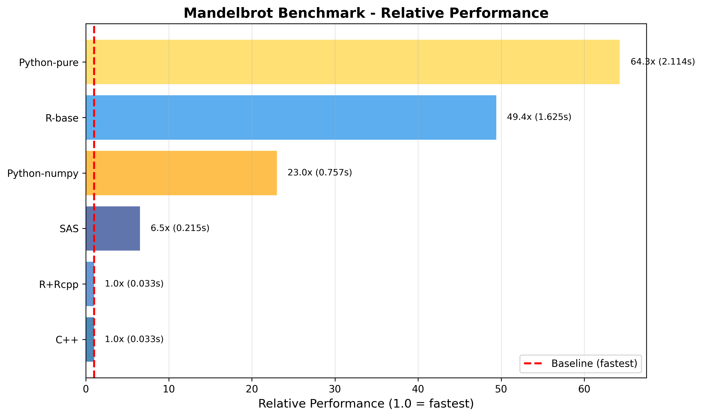
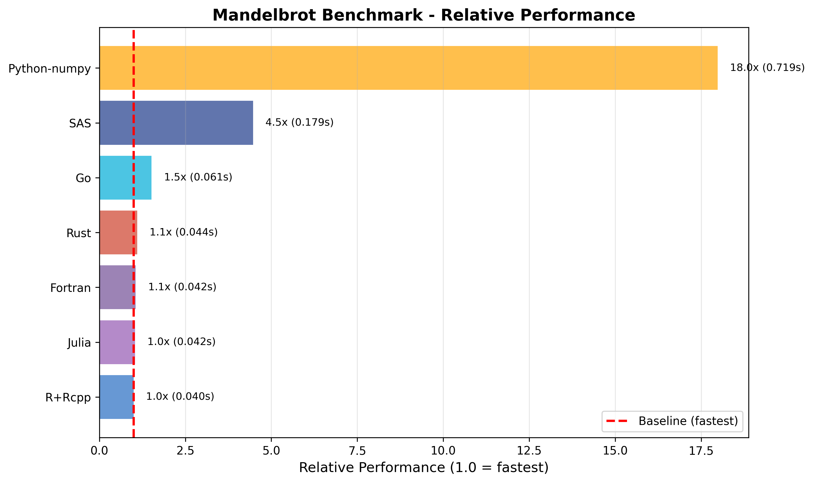

# Mandelbrot Set Performance Benchmark

A benchmark project comparing Mandelbrot set computation performance across multiple programming languages.

## 📁 Implementations

This project includes Mandelbrot set implementations in the following languages:

### Files in src/ directory

- `mandelbrot.cpp` - C++ implementation
- `mandelbrot.f90` - Fortran implementation
- `mandelbrot.go` - Go implementation
- `mandelbrot.jl` - Julia implementation
- `mandelbrot.m` - Octave/MATLAB implementation
- `mandelbrot.R` - Pure R implementation
- `mandelbrot.rs` - Rust implementation (single-threaded)
- `mandelbrot.sas` - SAS implementation
- `mandelbrot_Rcpp.R` - R+Rcpp implementation (C++ backend)
- `mandelbrot_parallel.rs` - Rust implementation (parallel version)
- `mandelbrot_py_pure.py` - Python implementation (pure Python)
- `mandelbrot_py_numpy.py` - Python implementation (NumPy)

## ⚙️ Computation Parameters

- **Image Size**: 800 × 600 pixels
- **Max Iterations**: 100
- **Complex Plane Range**: -2.0 ≤ Re(c) ≤ 1.0, -1.0 ≤ Im(c) ≤ 1.0

## 🔧 Compilation

Compilation commands for each language:

```bash
# C++
g++ -O3 -march=native -o mandelbrot_cpp src/mandelbrot.cpp

# Fortran
gfortran -O3 -march=native -o mandelbrot_fortran src/mandelbrot.f90

# Go
go build -o mandelbrot_go src/mandelbrot.go

# Rust (single-threaded)
rustc -O -C opt-level=3 -o mandelbrot_rust src/mandelbrot.rs
```

## 📋 Requirements

| Language/Tool | Description |
|--------------|-------------|
| **C++** (g++) | GCC compiler |
| **Fortran** (gfortran) | Fortran compiler |
| **Go** | Go compiler |
| **Rust** | Rust toolchain |
| **Python** | NumPy library required |
| **R** | Rcpp package recommended |
| **Julia** | Fast with JIT optimization |
| **SAS** | Commercial license required |
| **Octave** | MATLAB-compatible numerical environment |

## 📊 Benchmark Comparisons

This project includes two types of benchmarks:

### Benchmark v1
- C++
- R (Pure)
- R+Rcpp
- Python (Pure)
- Python (NumPy)
- SAS



### Benchmark v2
- Python (NumPy)
- R+Rcpp
- Julia
- SAS
- Rust
- Go
- Fortran



## 📄 License

This project is licensed under the MIT License, see the LICENSE file for details